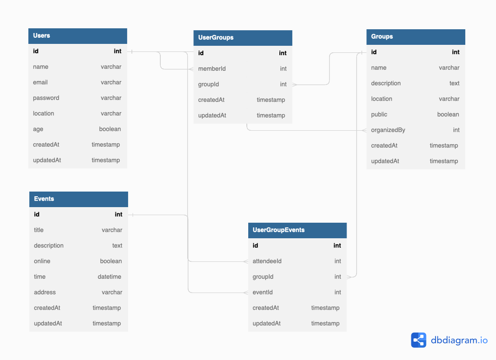

# Meetup Clone

## DB Schema


## API Documentation

### Add User
* Require Authentication: false
* Request
  * Method: POST
  * URL: /api/users
  * Headers:
    * Content-Type: application/json
  * Body:
  ```json
  {
    "name": "user name",
    "email": "user email",
    "password": "user password",
    "location": "user location",
    "age": "user age",
  }
  ```

* Successful Response
  * Status Code: 201
  * Headers:
    * Content-Type: application/json
  * Body:
    ```json
    {
      "message": "Successfully created",
      "statusCode": 201
    }
    ```

### Create a Group
* Require Authentication: true
* Request
  * Method: POST
  * URL: /api/groups
  * Headers:
    * Content-Type: application/json
  * Body:
  ```json
  {
    "name": "group name",
    "description": "description",
    "location": "group location",
    "public": "boolean value. true means public, false means private",
    "organizedBy": "user id creating this group",
  }
  ```

* Successful Response
  * Status Code: 201
  * Headers:
    * Content-Type: application/json
  * Body:
    ```json
    {
      "message": "Successfully created",
      "statusCode": 201
    }
    ```

### Create an Event
* Require Authentication: true
* Request
  * Method: POST
  * URL: /api/events
  * Headers:
    * Content-Type: application/json
  * Body:
  ```json
  {
    "title": "event title",
    "description": "description",
    "online": "boolean value. true means online event. false means offline event",
    "time": "datetime",
    "address": "address",
  }
  ```

* Successful Response
  * Status Code: 201
  * Headers:
    * Content-Type: application/json
  * Body:
    ```json
    {
      "message": "Successfully created",
      "statusCode": 201
    }
    ```

### Get User Information
* Require Authentication: true
* Request
  * Method: GET
  * URL: /api/users/:userId
  * Headers: none
  * Body: none

* Successful Response
  * Status Code: 200
  * Headers:
    * Content-Type: application/json
  * Body:
    ```json
    {
      {
        "name": "user name",
        "email": "user email",
        "location": "user location",
        "age": "user age"
      },
      "statusCode": 200
    }
    ```

### Get a Group Information
* Require Authentication: true
* Request
  * Method: GET
  * URL: /api/groups/:groupId
  * Headers: none
  * Body: none

* Successful Response
  * Status Code: 200
  * Headers:
    * Content-Type: application/json
  * Body:
    ```json
    {
      {
        "name": "group name",
        "description": "description",
        "location": "group location",
        "public": "boolean value. true means public, false means private",
        "organizedBy": "user id creating this group",
      },
      "statusCode": 200
    }
    ```

### Get All Group Information
* Require Authentication: true
* Request
  * Method: GET
  * URL: /api/groups/
  * Headers: none
  * Body: none

* Successful Response
  * Status Code: 200
  * Headers:
    * Content-Type: application/json
  * Body:
    ```json
    {
      [{
        "name": "group name",
        "description": "description",
        "location": "group location",
        "public": "boolean value. true means public, false means private",
        "organizedBy": "user id creating this group",
      }, ...],
      "statusCode": 200
    }
    ```

### Get an Event Information
* Require Authentication: true
* Request
  * Method: GET
  * URL: /api/events/:eventId
  * Headers: none
  * Body: none

* Successful Response
  * Status Code: 200
  * Headers:
    * Content-Type: application/json
  * Body:
    ```json
    {
      {
        "title": "event title",
        "description": "description",
        "online": "boolean value. true means online event. false means offline event",
        "time": "datetime",
        "address": "address",
      },
      "statusCode": 200
    }
    ```

### Get All Event Information
* Require Authentication: true
* Request
  * Method: GET
  * URL: /api/events/
  * Headers: none
  * Body: none

* Successful Response
  * Status Code: 200
  * Headers:
    * Content-Type: application/json
  * Body:
    ```json
    {
      [{
        "title": "event title",
        "description": "description",
        "online": "boolean value. true means online event. false means offline event",
        "time": "datetime",
        "address": "address",
      }, ...],
      "statusCode": 200
    }
    ```

### Modify User information
* Require Authentication: true
* Request
  * Method: PUT / PATCH
  * URL: /api/users/:userId
  * Headers:
    * Content-Type: application/json
  * Body: at least, one of below should be passed in
  ```json
  {
    "name": "user name",
    "email": "user email",
    "location": "user location",
    "age": "user age",
  }
  ```

* Successful Response
  * Status Code: 200
  * Headers:
    * Content-Type: application/json
  * Body:
    ```json
    {
      "message": "Successfully modified",
      "statusCode": 200
    }
    ```

### Change User Password
* Require Authentication: true
* Request
  * Method: PUT / PATCH
  * URL: /api/users/:userId/password
  * Headers:
    * Content-Type: application/json
  * Body:
  ```json
  {
    "password": "password that user want"
  }
  ```

* Successful Response
  * Status Code: 200
  * Headers:
    * Content-Type: application/json
  * Body:
    ```json
    {
      "message": "Successfully changed",
      "statusCode": 200
    }
    ```

### Modify a Group
* Require Authentication: true
* Request
  * Method: PUT / PATCH
  * URL: /api/groups/:groupId
  * Headers:
    * Content-Type: application/json
  * Body: at least, one of below should be passed in
  ```json
  {
    "name": "group name",
    "description": "description",
    "location": "group location",
    "public": "boolean value. true means public, false means private",
    "organizedBy": "user id creating this group",
  }
  ```

* Successful Response
  * Status Code: 200
  * Headers:
    * Content-Type: application/json
  * Body:
    ```json
    {
      "message": "Successfully created",
      "statusCode": 200
    }
    ```

### Modify an Event
* Require Authentication: true
* Request
  * Method: PUT / PATCH
  * URL: /api/events/:eventId
  * Headers:
    * Content-Type: application/json
  * Body: at least, one of below should be passed in
  ```json
  {
    "title": "event title",
    "description": "description",
    "online": "boolean value. true means online event. false means offline event",
    "time": "datetime",
    "address": "address",
  }
  ```

* Successful Response
  * Status Code: 200
  * Headers:
    * Content-Type: application/json
  * Body:
    ```json
    {
      "message": "Successfully modified",
      "statusCode": 200
    }
    ```

### Delete User information
* Require Authentication: true
* Request
  * Method: DELETE
  * URL: /api/users/:userId
  * Headers: none
  * Body: none

* Successful Response
  * Status Code: 200
  * Headers:
    * Content-Type: application/json
  * Body:
    ```json
    {
      "message": "Successfully deleted",
      "statusCode": 200
    }
    ```

### Delete a Group
* Require Authentication: true
* Request
  * Method: DELETE
  * URL: /api/groups/:groupId
  * Headers: none
  * Body: none

* Successful Response
  * Status Code: 200
  * Headers: none
  * Body:
    ```json
    {
      "message": "Successfully deleted",
      "statusCode": 200
    }
    ```

### Delete an Event
* Require Authentication: true
* Request
  * Method: DELETE
  * URL: /api/events/:eventId
  * Headers: none
  * Body: none

* Successful Response
  * Status Code: 200
  * Headers:
    * Content-Type: application/json
  * Body:
    ```json
    {
      "message": "Successfully deleted",
      "statusCode": 200
    }
    ```
